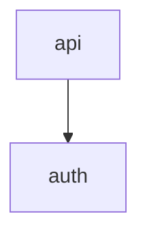

# 架构文档

> 由 arch-doc 生成。事实数据来自脚本，语义总结由 LLM 补充并标注推断。

## 1. 项目概览
- 项目名称：my-app
- 一句话描述：示例项目（Python FastAPI 服务）
- 架构风格：分层
- 仓库类型：monolith

## 2. 技术栈
- 语言：python
- 框架：fastapi、uvicorn
- 构建/运行：docker

## 3. 目录结构

```text
src/
├── api/
├── auth/
└── main.py
```

## 4. 模块职责
| 模块 | 路径 | 职责 | 关键文件 |
|---|---|---|---|
| auth | src/auth | 用户认证与权限控制 | src/auth/service.py |

## 5. 模块依赖关系
- 内部依赖表：api -> auth（import）
- Mermaid 图：



## 6. 入口点
| 类型 | 路径 | 启动命令 | 说明 |
|---|---|---|---|
| web | src/main.py | uvicorn src.main:app --reload | API 服务入口 |

## 7. 运行方式
| 操作 | 命令 | 工作目录 |
|---|---|---|
| install | pip install -e . | . |
| dev | uvicorn src.main:app --reload | . |

## 8. 关键流程
- **用户登录**：接收请求 -> 校验参数 -> 调用 auth 服务 -> 返回 token

## 9. 待确认/风险点
- auth 模块通过 importlib 动态加载，需人工确认

## 附录
- 扫描范围：src/（深度 3）
- 排除目录：.git、node_modules、dist、build、__pycache__、.venv
- 脚本命令：node scripts/arch-profile.mjs <repo> --all
- 生成时间：（生成时填写）
